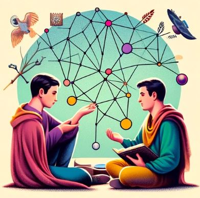

# AI Projects Repository

  

Ce répertoire contient une collection de quatre projets d'IA. Chaque projet est organisé dans son propre dossier et a un objectif unique.

### Tic Tac Toe
Un Tic Tac Toe avec un adversaire IA (O/X).

### Degrees*
Un projet pour calculer les degrés de séparation entre les acteurs.

### Knights
Intégration de la connaissance dans une IA pour résoudre des énigmes logiques.

### Minesweeper
IA pouvant résoudre un démineur.

